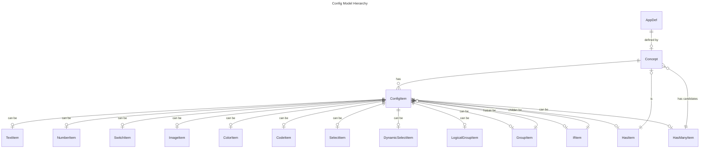

# Haya Configurator

## Overview

Haya configurator (`@hayadev/configurator`) is a headless library for modeling configurable web applications and components. The goal of this library is to help developers to build apps and components that can be easily configured by non-developers at design time. Traditionally this is achieved by either employing a config file (which is hard to author and maintain), or providing a tailored configuration UI (which is costly to build). Haya configurator takes a model-first approach and lets developers describe the app's configurability at an abstract level in TypeScript.

This approach brings the following benefits:

-   **Type-safe config**

    The configuration is defined in TypeScript, and IDE provides great support for type checking and auto-completion.

-   **Type-safe runtime model**

    Thanks to TypeScript's inference power, a strongly typed runtime config can be directly derived from the config model without any extra effort. When implementing the app or component's functionality, developers can again enjoy the type-safe benefits.

-   **Automatically derived config UI**

    The Haya configurator library is "headless" and doesn't provide any config UI. Since the model is UI-framework neutral, "heads" implemented in different frameworks and component libraries can be implemented. See [`@hayadev/configurator-vue`](../configurator-vue/README.md) for an implementation in Vue + Element-Plus.

-   **Flexibility**

    The config model is mainly defined in a declarative way for conciseness. However, for cases where more complex logic is needed, the model can be enriched with imperative code.

For a comprehensive example of how to use this library, see the [Form example](../samples/src/form/).

## Concepts

A config model has the following hierarchy:



### AppDef

`AppDef` is the root of a config model. It's defined with a single root [`Concept`](#concept). It also allows you to provide several app-level callbacks for defining various aspects of the app's behavior.

### Concept

`Concept` is the main construct used to define a config model. It represents a type of entity that can be configured. It usually maps to an entity that has a clear business meaning in the app. For example, in a "form" app, a `Concept` can represent a form, a page, a field, etc. In a configuration UI, a `Concept` usually fully occupies a panel.

Besides common properties like `name` and `description`, the most important part of a `Concept` is a list of [`ConfigItem`](#configitem)s. A `Concept` can also contain callback functions for defining various aspects of its behavior, e.g., initializing its config object, computing a summary text, doing custom validation, etc.

### ConfigItem

`ConfigItem` is the basic building block of a config model. It represents a single piece of configuration that can be set by the user. A `ConfigItem` can be of various types, such as `TextItem`, `NumberItem`, `SwitchItem`, etc. Different types of `ConfigItem`s have different properties, and are meant to be rendered differently in the configuration UI.

#### Simple Items

Simple config items like `TextItem`, `NumberItem`, `SwitchItem`, etc., are for configuring simple values. At runtime, they're mapped to corresponding JavaScript types - `string`, `number`, `boolean`, etc.

#### Complex Items

Some config items are more complex and designed for specific use cases.

-   **DynamicSelectItem**

    A `DynamicSelectItem` is a select item whose options are dynamically provided by a callback function. The function has access to the current config model and can do arbitrary computation or even make network requests to fetch the options.

    A typical use case of `DynamicSelectItem` is to provide a list of `Concept` instances in the current model. For example, in a "form" app, it can provide a list of form pages. It can achieve it by having the callback to return a list of "concept references" of the following format:

    ```ts
    {
        $type: 'ref',
        $concept: [Concept Name],
        $id: [Concept ID]
    }
    ```

-   **LogicalGroupItem**

    `LogicalGroupItem` is a high-level item that allows to configure a complex logical condition involving nesting and grouping expressions using "AND" and "OR" operators. It's designed for cases where a conditional action needs to be expressed. For example, in a "form" app, it can be used to configure what page the "next" button should go to based on the the answers collected so far.

    The behavior of a `LogicalGroupItem` is fully customized by several callback functions:

    -   Computing the left operand of a boolean expression.
    -   Computing the available operators of a boolean expression.
    -   Computing the right operand of a boolean expression.

    At runtime, the model of this config item is a tree structure containing terminal boolean expressions and logical expressions ("AND"/"OR"). The app's developer is responsible for interpreting this tree and evaluating it to a boolean value.

#### Composite Items

-   **IfItem**

    `IfItem` allows to conditionally "activating" a child `ConfigItem` based on the conditional value computed by a callback.

-   **GroupItem**

    `GroupItem` is a container item that groups a list of child `ConfigItem`s. It's useful for breaking down and organizing a large set of config items. At runtime, a `GroupItem` introduces a new level of nesting in the config object.

    > **What's the difference between a `GroupItem` and a `Concept`?**
    >
    > They're similar in that they both include a list of `ConfigItem`s. There are several differences:
    >
    > -   A `Concept` usually has a clear business meaning, while a `GroupItem` is more for pure grouping.
    > -   A `Concept` instance can be referenced by its ID (as shown in the `DynamicSelectItem` example), while a `GroupItem` is not referenceable.
    > -   A `Concept` usually occupies a full panel in the configuration UI, while a `GroupItem` is usually rendered inline.

-   **HasItem**

    `HasItem` is a special item that represents a "has-one" relationship between two `Concept`s. It's used to configure a reference to another `Concept`. At runtime, its model has the same type as the `Concept` it references.

-   **HasManyItem**

    `HasManyItem` is a special item that represents a "has-many" relationship between two or among several `Concept`s. It's configured with a list of "candidate" concepts that are allowed as its children. At runtime, its model is an array of the types as the concepts it references.

## API

### defineApp

```ts
declare function defineApp<TConcept extends Concept>(def: AppDef<TConcept>): AppDef<TConcept>;
```

Helper function for defining an app's config model. It's a simple wrapper around the `AppDef` type. [Code](./src/app.ts)

#### Example

```ts
import { Form } from './concepts/form';

const formApp = defineApp(Form);
```

### defineConcept

```ts
declare function defineConcept<TItems extends Concept['items']>(def: Concept<TItems>): Concept<TItems>;
```

Helper function for defining a `Concept`. It's a simple wrapper around the `Concept` type. [Code](./src/concept.ts)

#### Example

```ts
const Form = defineConcept({
    name: 'Form',
    displayName: 'Supa Form'
    description: 'This is a form concept',
    items: {
       title: { type: 'text', required: true, name: 'Form Title', placeholder: 'Please input a title' },
       ...
    },
});
```

### Config item types

Config item type definitions can be found in the [`src/items`](./src/items) directory.

### inferConcept

```ts
type inferConcept<TConcept extends Concept, TPartial extends boolean = false>;
```

A type API for inferring the runtime model type of a `Concept`. [Code](./src/inference.ts.ts)

#### Example

```ts
const Form = defineConcept({
    name: 'Form',
    displayName: 'Supa Form'
    description: 'This is a form concept',
    items: {
       title: { type: 'text', required: true, name: 'Form Title', placeholder: 'Please input a title' },
       ...
    },
});

type FormModel = inferConcept<typeof Form>;
// FormModel type is inferred as: { title: string, ...}
```

### createAppInstance

```ts
declare function createAppInstance<TConcept extends Concept>(
    def: AppDef<TConcept>,
    version: string
): AppInstance<TConcept>;
```

Helper function for creating an app instance from an `AppDef`. An `AppInstance` allows you to create, manipulate, and validate a config model object. [Code](./src/app-instance.ts)

## Validation

One of the benefits of using Haya configurator to model an app is to have type safety at runtime. Type safety means two things:

1. The config object is sufficiently typed with TypeScript
2. The config object's runtime value conforms to the type

#1 is achieved with TypeScript's type inference and checking. #2 is achieved by deriving a runtime validator from the config model. Haya configurator internally uses [Zod](https://zod.dev/) for runtime validation. The entire config model tree is reflected into a Zod schema, from the very top-level concept, all the way to the leaf-level config items.

Model validation can be done by calling the `validateModel` method on an `AppInstance`:

```ts
import { FromApp } from './app';

const appInstance = createAppInstance(FormApp, '1.0.0');
const validationResult = appInstance.validateModel({ ... });
if (!validationResult.success) {
    validationResult.issues.forEach(console.error);
} else {
    // validationResult.model is the validated model object
}
```

## Model Migration

As an app evolves, its config model will change and the changes may not be directly backward compatible. Haya configurator provides a simple mechanism for the app developer to implement how to migrate an old model to match the new schema.

The `Concept` type accepts an optional `import` callback designed for such migration work:

```ts
type Concept = {
    ...
    import?: (data: object, metadata: ImportMetadata) => ImportResult<Concept>;
};
```

Developers can get the model version of the input data from `metadata` and decide what adaptations need to be made.

The `import` function will be called by the design-time hosting environment (where the configuration UI is rendered) when loading a previously saved model.

## AI-Powered Model Generation

The declarative way of defining a config model provides the opportunity to leverage LLMs to generate a model instead of building it up manually. Haya configurator provides a simple way to interface with such an external model generator. The `AppDef` type accepts a `generateModel` callback for this purpose:

```ts
type AppDef = {
    ...
    generateModel?: (args: ModelGenerationArgs) => Promise<ModelGenerationResult>;
};
```

The main information carried by the args is:

-   `currentModel`: the current model object that can be used as context for incremental generation.
-   `kind`: the generation is conceptually divided into two steps: 1. converting user's requirements into a content plan; 2. converting the content plan into a model object. The `kind` field will be "user-input" for phase 1, and "elaboration" for phase 2.
-   `data`: the input data string (its meaning depends on the `kind`).
-   `secrets`: a secret object that contains information needed for the generation (e.g., LLM api keys).
-   `userIdentity`: the identity of the user who's making the call (for logging and auditing purposes).

Note that the `generateModel` callback is executed on the server side of the design-time hosting environment. The `secrets` object is pre-configured in the environment for the app and will not be exposed to the client side.

To facilitate the user experience of the AI generation process, the `AppDef` type accepts another callback `generateModelHint` that you can use to provide hint messages to the user (for each phase of the generation):

```ts
type AppDef = {
    ...
    generateModelHint?: (args: ModelGenerationHintProviderArgs) => string;
};
```

## Future Work

### UI Hints

Although Haya configurator focuses on the modeling part and is UI agnostic, there might be cases where a preference on how a config item is rendered is desired. For example, a `NumberItem` can be desired to be shown as a slider instead of a plain input.

This can probably be achieved by attaching "weak hints" to the config items. For example:

```ts
{
    age: { type: 'number', uiHint: 'slider' },
    ...
}
```

However, care needs to be taken not to "pollute" the config model too much with UI-related artifacts. If this becomes a common need, maybe a better idea is to have a separate "complementary" model that describes how the config items should be rendered.
